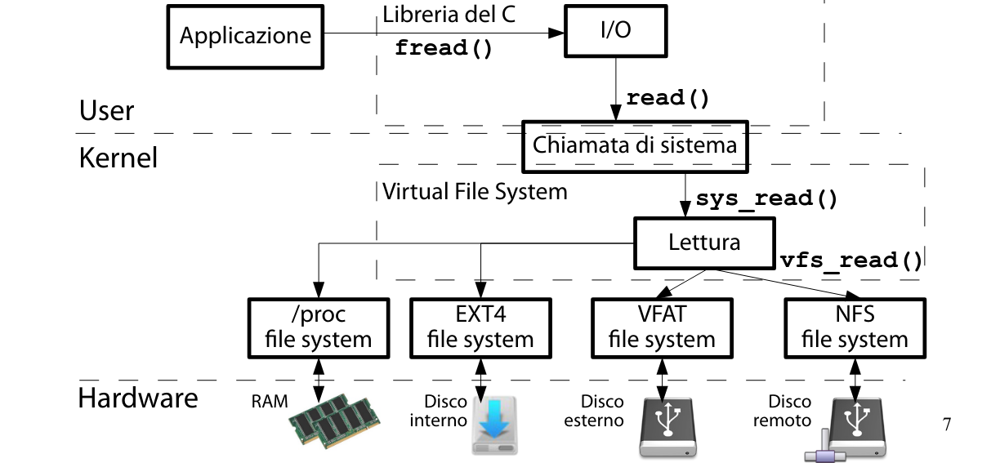

### Virtual File System

**Virtual File System**
È un sottosistema del kernel. In Linux è implementato dai file nella directory `/` contenuti nella directory `$LINUX/fs.`

**Utilità VFS**
Il VFS da una visione omogenea e gerarchica al contenuto del file system ottenuto da periferiche locali (HDD, chiavette), periferiche remote (rete) e kernel.

**Utilità Visione Omogenea**

