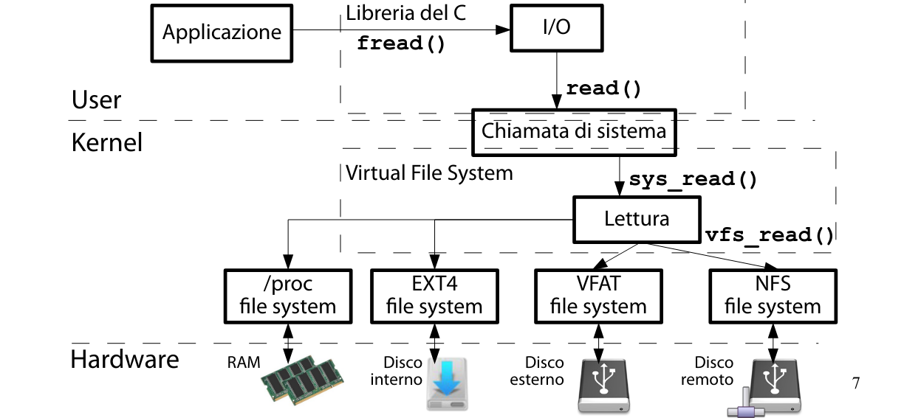
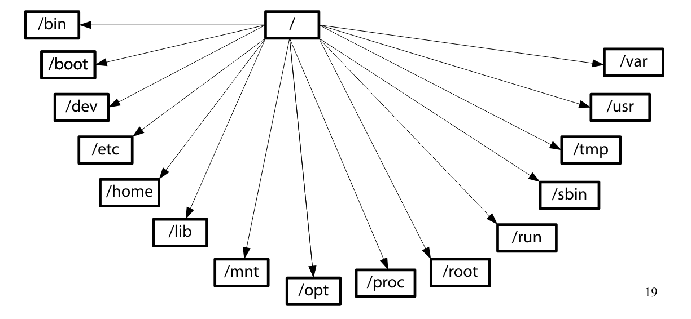

### Virtual File System

**Virtual File System**
È un sottosistema del kernel. In Linux è implementato dai file nella directory `/` contenuti nella directory `$LINUX/fs.`

**Utilità VFS**
Il VFS da una visione omogenea e gerarchica al contenuto del file system ottenuto da periferiche locali (HDD, chiavette), periferiche remote (rete) e kernel.

**Utilità Visione Omogenea**

**Compiti VFS**
Il VFS si occupa di decomporre il percorso di un file nelle sue componenti, fino ad arrivare ai dispositivi in cui è contenuto. Inoltre gestisce i descrittori dei file aperti che punteranno alle operazioni possibili di un file.

**Struct Inode**
Nei sistemi UNIX l'FCB di un file è contenuto in una struttura dati immessa in un dato, l'inode.
- In EXT4 è definito nella `struct ext4_inode` nel file `$LINUX/fs/ext4/ext4.h`

**Inode VFS**
Diversi file system hanno diverse definizioni di inode. Il VFS nella `struct inode` definisce un formato di inode compatibile con tutti i file system.
- Struttura creata alla prima apertura di un file. L'inode viene riempito dai metadati in inode del disco e spostato in memoria centrale per questioni di efficienza.
- Struttura definita nel file `$LINUX/include/fs.h`

**Struct File**
La `struct file` rappresenta un file aperto. Contiene informazioni dinamiche come modalità di apertura, percorso del file, posizione nel file, puntatore all'inode del VFS e puntatore alle operazioni possibili sul file. Viene definita nel file `$LINUX/include/fs.h`

**Struct Dentry** 
La `struct dentry` rappresenta un elemento del percorso di un file. Esempio, il file `/bin/vi` è composto da due dentry; `/bin (percorso) e vi (file).` Quando il kernel riceve per la prima volta un path costruisce le due dentry e le inserisce nella dentry cache, un albero in memoria centrale. Definita nel file `$LINUX/include/dcache.h`
- I lookup successivi al primo vengono fatti in memoria centrale.

**Path Name Lookup (Analisi Percorso di File)**
È un operazione parecchio costosa e frequente. La dentry cache semplifica l'operazione, riducendola ad una visita di un albero binario in memoria centrale.
- Definito in `$LINUX/fs/namei.c` in particolare dalla funzione `vfs_path_lookup().`

**Struct File Operations**
La `struct file_operations` è un array di puntatori a funzione che rappresentano le operazioni possibili in un file. Definita nel file `$LINUX/include/fs.h`
- Operazioni come scrittura, lettura, apertura, chiusura, flush...

**Struct Dentry Operations**
La `struct dentry_operations` è un array di puntatori a funzione che rappresentano le operazioni possibili su un elemento del percorso. La struttura occupa 64 byte. Questo è stato fatto per occupare esattamente una linea di cache, l'accesso sarà immediato.
- Definito in `$LINUX/include/dcache.h`
- Operazioni come individuazione mountpoint, eliminazione di una entry dalla cache, confronto tra stringhe...

## Albero delle Directory

**File Hierarchy System**
È lo standard in cui il VFS viene organizzato. Abbiamo in totale 15 sottodirectory.

- `/bin:` File e comandi necessari per un sistema di base testuale.

- `/boot:` Dati necessari per il boot del sistema operativo come le immagini del kernel e le configurazioni del bootloader.

- `/dev:` File speciali del dispositivo. Servono per comunicare a basso livello coi vari dispositivi.

- `/etc:` Configurazioni di sistema valida per tutti gli utenti sui vari software del PC.

- `/home:` Spazio di lavoro degli utenti. Viene organizzato in directory come desktop, documenti, immagini...

- `/lib:` Librerie statiche e dinamiche come le librerie del C, load dinamico e moduli del kernel.

- `/mnt:` Mountpoint delle periferiche. Al giorno d'oggi deprecato e sostituito dalla directory `/media.`

- `/opt:` Root file system dedicato ai programmi di terze parti non-free. Contiene le directory `bin, sbin, lib e usr.`

- `/proc:` Informazioni statistiche sui processi e risorse hardware/software. Vengono generate dal kernel.

- `/root:` Spazio di lavoro usato dagli amministratori.

- `/run:`  È un file system mantenuto in memoria centrale. Contiene i file volatili utili per l'esecuzione di un servizio.
  - **Esempio**: Uno script di un servizio deve sapere lo stato del servizio stesso, quindi conoscere il suo PID. Un file volatile può essere proprio il PID del processo padre. Lo script di terminazione del servizio quindi sa quale processo uccidere.

- `/sbin:` Comandi di amministrazione di utenti/periferiche. Contiene inoltre l'eseguibile init che fa partire tutti i processi.

- `/tmp:` È un file system mantenuto in memoria centrale. Contiene i file temporanei di un applicazione che verranno eliminati ad ogni riavvio dell'app.

- `/usr:` File system dedicato ai software non necessari al boot, quindi desktop grafici, web browser, giochi... Contiene le directory `bin, sbin, lib e usr.`
  - `/usr/local:` Dedicato ai software installati direttamente dall'amministratore.
  
- `/var:` File che all'aumentare del tempo crescono di spazio (log, gestore dei pacchetti...)

## Uso del VFS

**Clonazione Dischi**
Il comando effettua una copia blocco per blocco del disco `/dev/sda` nel disco `/dev/sdb.`
- `dd if=/dev/sda of=/dev/sdb`

**Masterizzatore CD**
Il comando effettua una copia blocco per blocco dell'iso `img.iso` del CD in `/dev/cdrw.`
- `dd if=img.iso of=/dev/cdrw.`

**Lettura Contenuto Partizione**
Il comando legge il contenuto della partizione `/dev/sda2.`
- `strings /dev/sda2.`

**Visione Terminale**
Il comando stampa per ogni secondo la schermata di tty2.
- `watch -n 1 fold -w 80 /dev/vcs2.`
- Per verificarne il funzionamento basta eseguire il comando ed andare in tty2 a digitare delle stringhe. Una volta tornati sul terminale si nota come appaiono le stringhe digitate in precedenza.

**Statistiche Processo**
Per ogni processo il kernel crea in /proc tutte le sue informazioni statistiche.
- Il comando `ls -l /proc/PID/fd` mostra i file aperti dal processo.